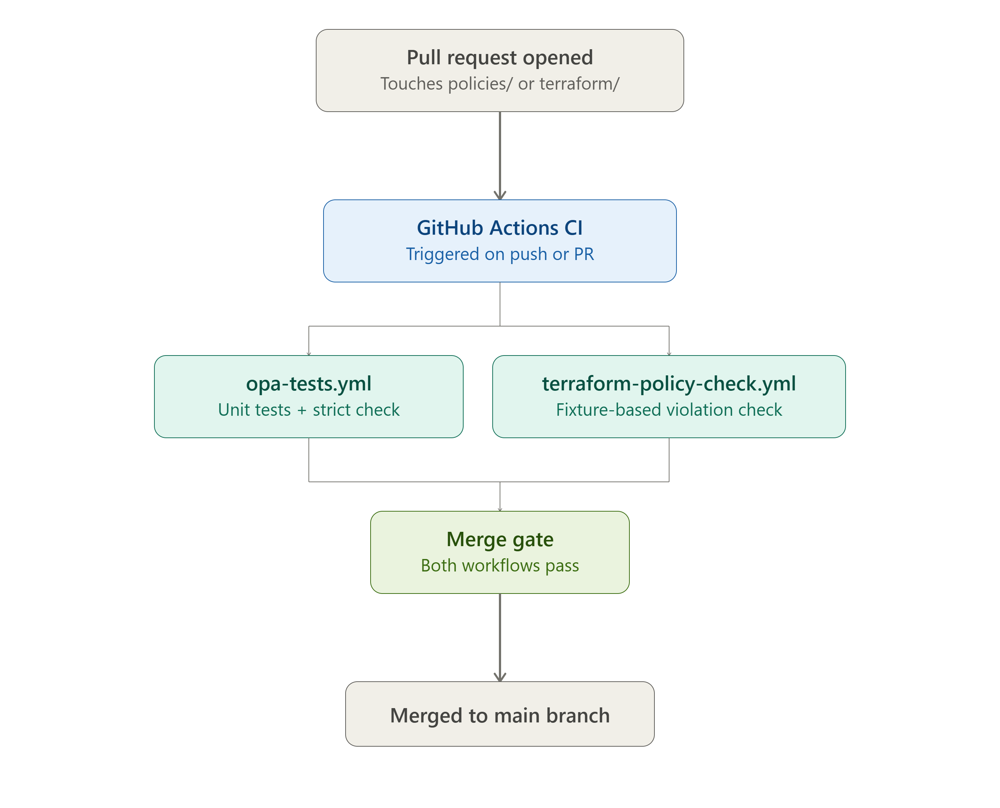

# Compliance as Code

Stop treating compliance like a document. Start treating it like production software.

Most cloud architects are still stuck managing compliance with giant, outdated spreadsheets — mapping every Terraform resource to PCI DSS, SOC 2, and NIST 800-53 controls for yet another quarterly sign-off. The dirty secret? That spreadsheet is just a statement of intent. It tells you nothing about what actually shipped to production last Tuesday.

This repo is my attempt to fix that gap. Instead of relying on plausible deniability and manual checklists, I'm using Policy-as-Code with OPA (Open Policy Agent). Every Terraform change gets scanned before a single resource hits the cloud. If it violates a security or compliance rule, the PR is blocked.

## The Core Idea

The real question is: Can we turn a regulatory requirement into an automated, repeatable, provable check that runs on every pull request? That's what this project is built around.

## It's a Program, Not Just Policies

This isn't just a pile of Rego files. It's meant to be a real engineering program with the same standards we apply to infrastructure:

- **Traceability:** `docs/controls-mapping.md` links specific regulatory citations to the actual policy rules. No more wondering which control covers what, and no duplicated effort across frameworks.
- **Discipline:** The policies are version-controlled, unit tested, and enforced in CI — just like the rest of our code.
- **Honesty:** Scope limitations are documented. These policies catch what they catch; they don't replace a QSA.

## Repository Layout

```
compliance-as-code/
├── policies/
│   ├── lib/utils.rego        # Shared constants (primitive roles, sensitive ports, etc.)
│   ├── pci_dss/              # req_1 network, req_2 defaults, req_6 encryption, req_7 access, req_10 logging
│   ├── soc2/                 # cc6 logical access, cc7 system operations
│   └── nist_800_53/          # ac access control, au audit logging, sc comms protection
├── tests/
│   ├── pci_dss/              # Unit tests — deny path + allow path for every rule
│   ├── soc2/
│   ├── nist_800_53/
│   └── fixtures/
│       ├── compliant.tfplan.json     # Should produce 0 violations
│       └── noncompliant.tfplan.json  # Should trigger violations across all frameworks
├── terraform/
│   ├── compliant/            # Reference-compliant GCP infrastructure
│   └── noncompliant/         # Deliberately violating config (for CI validation only)
├── docs/
│   └── controls-mapping.md   # Requirement → policy rule citation table
├── scripts/
│   └── check-plan.sh         # Local evaluation script
└── .github/workflows/
    ├── opa-tests.yml              # Unit tests (no GCP credentials needed)
    └── terraform-policy-check.yml # Fixture-based compliance check (no GCP credentials needed)
```

## Try It Yourself (No Cloud Credentials Needed)

Pre-baked Terraform plan fixtures are committed so you can run policy checks locally without GCP access.

```bash
# Run all unit tests
opa test policies/ tests/pci_dss/ tests/soc2/ tests/nist_800_53/ -v

# Check the deliberately noncompliant fixture — should print violations
./scripts/check-plan.sh tests/fixtures/noncompliant.tfplan.json

# Check the compliant fixture — should pass clean
./scripts/check-plan.sh tests/fixtures/compliant.tfplan.json

# Evaluate one framework directly
opa eval -d policies/ -i tests/fixtures/noncompliant.tfplan.json \
  '[m | m := data.pci_dss[_].deny[_]]'
```

## OPA Version

Requires **OPA v0.59+**. New policies (`req_*`, `cc*`, `ac`, `au`, `sc`) use `import rego.v1`. Legacy policies (`network_segmentation`, `access_control`, `encryption_at_rest`, `logging_monitoring`, `least_privilege`) use `import future.keywords` — both syntaxes coexist without conflict. CI installs OPA v1.0.0.

```bash
# Install (Linux)
curl -fsSL -o /usr/local/bin/opa \
  https://github.com/open-policy-agent/opa/releases/download/v1.0.0/opa_linux_amd64_static
chmod +x /usr/local/bin/opa

# Install (macOS)
brew install opa
```

## Framework Coverage

| Framework | Requirements Enforced |
|---|---|
| PCI DSS v4.0 | 1.3.2, 2.2.1, 6.3.5, 6.5.3, 7.2.5, 7.2.6, 10.2.1, 10.3.2 |
| SOC2 TSC (2017) | CC6.1, CC6.3, CC6.6, CC6.7, CC7.1, CC7.2, CC8.1 |
| NIST SP 800-53 Rev 5 | AC-3, AC-6, AC-17, AU-2, AU-9, AU-12, SC-8, SC-28 |

Full citation table with per-rule breakdown: [`docs/controls-mapping.md`](docs/controls-mapping.md)

## CI

Two GitHub Actions workflows trigger on every push or PR touching policies or Terraform:




| Workflow | What it checks | Credentials needed |
|---|---|---|
| `opa-tests.yml` | All OPA unit tests pass; `opa check --strict` syntax validation | None |
| `terraform-policy-check.yml` | Noncompliant fixture triggers ≥1 violation; compliant fixture produces 0 violations | None |

## What This Isn't

This gives you strong preventive compliance at deploy time, but it's not magic. It doesn't solve runtime drift, configuration changes made in the console, or replace a proper QSA/auditor sign-off. See [`docs/controls-mapping.md`](docs/controls-mapping.md) for a clear view of what's covered and what still needs human eyes.
